本篇文章主要介绍组件库使用的开发工具，正所谓：工欲善其事，必先利其器。

## TL;DR



其中：

- husky：通过 git hooks 在不同阶段执行不同命令
- lint-staged：在`pre-commit`阶段执行，只对修改的代码文件进行代码格式化和规范化
- prettier：代码格式化工具
- stylelint：对样式代码进行规范检查
- eslint：对 JavaScript 代码进行规范检查
- commitizen：在`prepare-commit-msg`阶段执行，帮助用户编写规范的 commit message
- commitlint：在`commit-msg`阶段对 commit message 格式进行检查

## husky

在 git 提交代码时，husky 可被用来 lint commit messages，lint 代码，执行测试，等等。

用 `husky-init` 来安装和初始化：

```bash
npx husky-init && yarn
```

对于 husky 的使用，后文通过安装其他工具时来介绍。​

## lint-staged

只对修改的文件执行 linters，提高检查速度。执行效果：

```bash
$ git commit

✔ Preparing lint-staged...
❯ Running tasks for staged files...
  ❯ packages/frontend/.lintstagedrc.json — 1 file
    ↓ *.js — no files [SKIPPED]
    ❯ *.{json,md} — 1 file
      ⠹ prettier --write
  ↓ packages/backend/.lintstagedrc.json — 2 files
    ❯ *.js — 2 files
      ⠼ eslint --fix
    ↓ *.{json,md} — no files [SKIPPED]
◼ Applying modifications from tasks...
◼ Cleaning up temporary files...
```

### 开始使用

安装：

```bash
npx mrm@2 lint-staged
```

配置：

```javascript title='lint-staged.config.js'
module.exports = {
  "**/*": "prettier --write --ignore-unknown",
  "**/*.css": "stylelint --cache --fix",
  "**/*.(j|t)s?(x)": "eslint --cache --fix",
};
```

对于 Prettier、Stylelint 和 ESLint 的配置，参考：

- [Prettier 使用教程](/blog/2020/11/03/prettier-usage)
- [Stylelint 使用教程](/blog/2020/11/04/stylelint-usage)
- [ESLint 使用教程](/blog/2020/11/05/eslint-usage)

### 与 husky 集成

```bash
yarn husky add .husky/pre-commit "npx lint-staged"
```

## Commitizen

它是一个撰写合格 Commit Message 的工具。

### 安装

```bash
yarn add -D commitizen
```

然后初始化约定的 changelog 适配器：

```bash
yarn commitizen init cz-conventional-changelog --save-dev --save-exact
```

这里可以将 package.json 文件中的修改移动到 `.czrc` 文件中：

```json title='.czrc'
{
  "path": "cz-conventional-changelog"
}
```

### 与 husky 集成

```bash
yarn husky add .husky/prepare-commit-msg "exec < /dev/tty && git cz --hook || true"
```

后面在执行 `git commit` 的时候就会显示 commitizen 的提示。​

## commitlint

帮助您的团队遵守提交约定。通过支持 npm 安装的配置，可以轻松共享提交约定。

### 快速开始

安装：

```bash
yarn add --dev @commitlint/config-conventional @commitlint/cli
```

配置：

```bash
echo "module.exports = {extends: ['@commitlint/config-conventional']}" > commitlint.config.js
```

### 与 husky 集成

```bash
yarn husky add .husky/commit-msg 'npx commitlint --edit $1'
```

## 参考

- [https://typicode.github.io/husky/#/](https://typicode.github.io/husky/#/)
- [https://github.com/okonet/lint-staged](https://github.com/okonet/lint-staged)
- [http://commitizen.github.io/cz-cli/](http://commitizen.github.io/cz-cli/)
- [https://commitlint.js.org/#/](https://commitlint.js.org/#/)

## 快速开始

为了方便大家快速搭建起来，我在 GitHub 上建了模版仓库，如下：

- [design-system-template-react](https://github.com/jack0pan/design-system-template-react/generate)
