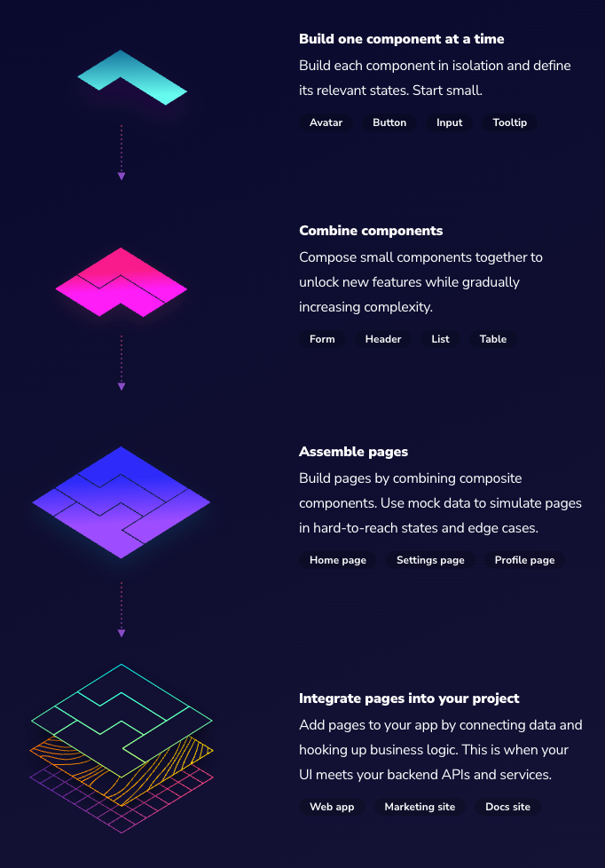

本文就来介绍组件库的主角：组件。先从组件的定义说起。

## 组件的定义

组件是标准化的、可互换的 UI 模块。它们封装了 UI 部分的外观和功能。想想乐高积木。乐高积木可用于建造从城堡到宇宙飞船的所有东西，组件可以拆开并用于创建新功能。
组件通过将状态与应用程序业务逻辑隔离来实现互换性。这样，你可以将复杂的屏幕分解成简单的组件。每个组件都有定义明确的 API 和可被 Mock 的系列状态。这允许组件被拆开和重组，以构建不同的 UI。

## 组建驱动 UI

前面明确了组件定义之后，如何从一个个组件构建出完整的 UI。过程如下：



- 一次构建一个组件：隔离构建每个组件并定义其相关状态。从小处着手。
- 组合组件：将小组件组合在一起以解锁新功能，同时逐渐增加复杂性。
- 组装页面：通过组合复合组件来构建页面。使用 Mock 数据模拟页面的难以到达状态和边缘情况。
- 集成到项目中：通过连接数据和连接业务逻辑，将页面添加到您的应用程序。

组件驱动 UI 的好处：

- 质量: 通过隔离构建组件并定义其相关状态，验证用户界面在不同场景中工作。
- 耐用性: 通过在组件级别进行测试，将缺陷精确到细节。它比测试屏幕工作更少，也更精确。
- 速度: 通过重用组件库或设计系统中的现有组件，更快地组装 UI。
- 效率: 通过将用户界面分解成离散的组件，然后在不同的团队成员之间分担负载，并行化开发和设计。

## 组件规范

### 目录规范

```plain
src/component
├── Component.tsx
├── Component.test.tsx
├── index.css
├── index.ts
└── interfaces.ts
```

其中：

- `Component.tsx`：组件的具体实现
- `Component.test.tsx`：组件的单元测试
- `index.css`：组件的 CSS 样式
- `index.ts`：export 组件本身和它的 `props`
- `interfaces.ts`：组件 `props` 的定义

### 实现规范

以 `Button` 组件为例:

```typescript title='src/button/Button.tsx'
import * as React from "react";
import { ButtonProps } from "./interfaces";

const Button = React.forwardRef<HTMLButtonElement, ButtonProps>((props, ref) => {
  // snipped
  return (
    <button ref={ref} {...rest}>
      // snipped
    </button>
  );
});

Button.displayName = "Button";
Button.defaultProps = {
  // snipped
};

export default Button;
```

1. Ref 转发
   Ref 转发是一项将 ref 自动地通过组件传递到其一子组件的技巧。对于大多数应用中的组件来说，这通常不是必需的。但其对某些组件，尤其是可重用的组件库是很有用的。

`Button` 使用 `React.forwardRef` 来获取传递给它的 `ref`，然后转发到它渲染的 `DOM button`。

2. displayName
   `displayName` 字符串多用于调试消息。通常，你不需要设置它，因为它可以根据函数组件或 `class` 组件的名称推断出来。

因为我们使用了 `forwardRef`，这里手动设置一下。

3. defaultProps
   `defaultProps` 可以为组件添加默认 `props`。这一般用于 `props` 未赋值，但又不能为 null 的情况。

### `Props` 规范

```typescript title='src/button/interfaces.ts'
interface BaseProps {
  /**
   * The name of custom css class
   */
  className?: string;
  /**
   * Custom css style
   */
  style?: React.CSSProperties;
}

export interface ButtonProps extends BaseProps & React.ButtonHTMLAttributes<HTMLButtonElement> {
  /**
   * Five types of button
   */
  variant?: 'filled' | 'outlined' | 'text' | 'elevated' | 'tonal';
}
```

1. 必须要有 `className` 和 `style`，`className` 用于设置自定义样式名，`style` 用于自定义样式；
2. 如果本身是 HTML 元素，必须继承 HTML 元素的属性。

## 参考

- [Component Driven User Interfaces](https://www.componentdriven.org/)
