本文介绍如何用 Tailwind CSS 来实现 Design System 中组件的样式。
​

## 介绍

Tailwind CSS 官方介绍是：在不离开 HTML 文件的情况下，快速构建现代化网站。原文见：

> Rapidly build modern websites without ever leaving your HTML.

官网中还提到一点特性：它还是构建 Design System 的 API。

> An API for your design system.
> Utility classes help you work within the constraints of a system instead of littering your stylesheets with arbitrary values. They make it easy to be consistent with color choices, spacing, typography, shadows, and everything else that makes up a well-engineered design system.

其他特性介绍见官网。
​

## 快速开始

它有多种安装方式，这里推荐 PostCSS 插件形式。

1. 安装 Tailwind CSS，并创建 `tailwind.config.js` 文件：

```bash
npm install -D tailwindcss postcss autoprefixer
npx tailwindcss init
```

2. 添加 Tailwind CSS 到 PostCSS 配置文件中，创建 `postcss.config.js` 文件：

```javascript
module.exports = {
  plugins: {
    tailwindcss: {},
    autoprefixer: {},
  },
};
```

3. 在 `tailwind.config.js` 中配置模板文件目录：

```javascript
module.exports = {
  content: ["./src/**/*.{html,js}"],
  theme: {
    extend: {},
  },
  plugins: [],
};
```

4. 添加 Tailwind 基础样式 `src/index.css` 文件中：

```css
@tailwind base;
@tailwind components;
@tailwind utilities;
```

5. 到这里就可以开始网页开发了！

## 进阶设置

### 构建时导入

尤其在 Design System 中，我们希望不同组件样式在不同文件，最后把所有组件的样式文件整合到一起。这时候就用到 `postcss-import` 了。
先安装插件：

```bash
yarn add -D postcss-import
```

然后把它添加到 PostCSS 配置文件中，**一定要把它放在第一位！**

```javascript title='postcss.config.js'
module.exports = {
  plugins: [
    'postcss-import': {},
    tailwindcss: {},
    autoprefixer: {},
  ]
}
```

最后就可以 import 其他文件了：

```css title='src/index.css'
@import "tailwindcss/base";
@import "./custom-base-styles.css";

@import "tailwindcss/components";
@import "./custom-components.css";

@import "tailwindcss/utilities";
@import "./custom-utilities.css";
```

### 支持嵌套

为了支持嵌套声明，可以使用 `tailwindcss/nesting`，它是对 `postcss-nested` 的绑定实现。使用方式如下：

```javascript title='postcss.config.js'
module.exports = {
  plugins: [
    'postcss-import': {},
    'tailwindcss/nesting': {},
    tailwindcss: {},
    autoprefixer: {},
  ]
}
```

### CSS 变量

不需要其他插件，可以直接使用，比如：

```css
:root {
  --theme-color: #52b3d0;
}

/* ... */

.btn {
  background-color: var(--theme-color);
  /* ... */
}
```

### Vendor prefixes

使用 Autoprefixer 来实现，在快速开始时已经安装了，单独安装如下：

```bash
yarn add -D autoprefixer
```

然后配置 postcss：

```javascript
module.exports = {
  plugins: {
    tailwindcss: {},
    autoprefixer: {},
  },
};
```

### 与编辑器集成

- [VS Code](https://marketplace.visualstudio.com/items?itemName=bradlc.vscode-tailwindcss)
- [JetBrains IDEs](https://www.jetbrains.com/help/webstorm/tailwind-css.html)

## 自定义主题

不同的 Design System 往往有不同颜色、字体、间距等等，这些都可以在 `tailwind.config.js` 中自定义。如下：

```javascript title='tailwind.config.js'
module.exports = {
  theme: {
    screens: {
      sm: "480px",
      md: "768px",
      lg: "976px",
      xl: "1440px",
    },
    colors: {
      blue: "#1fb6ff",
      pink: "#ff49db",
      orange: "#ff7849",
      green: "#13ce66",
      "gray-dark": "#273444",
      gray: "#8492a6",
      "gray-light": "#d3dce6",
    },
    fontFamily: {
      sans: ["Graphik", "sans-serif"],
      serif: ["Merriweather", "serif"],
    },
    extend: {
      spacing: {
        128: "32rem",
        144: "36rem",
      },
      borderRadius: {
        "4xl": "2rem",
      },
    },
  },
};
```

## 组件样式

最后一点，如何实现单个组件的样式。
以 button 组件为例，在 `src/button/index.css` 中如下实现：

```css
.btn {
  @apply bg-violet-500 hover:bg-violet-400 active:bg-violet-600 focus:outline-none focus:ring focus:ring-violet-300;
}
```

然后在 `src/index.css` 中引入：

```css
@import "tailwindcss/base";

@import "tailwindcss/components";

@import "tailwindcss/utilities";

@import "./button/index.css";
```

## 参考

- [https://tailwindcss.com/docs/installation](https://tailwindcss.com/docs/installation)
