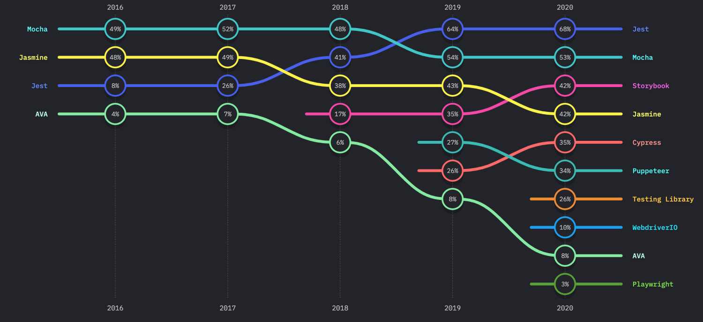
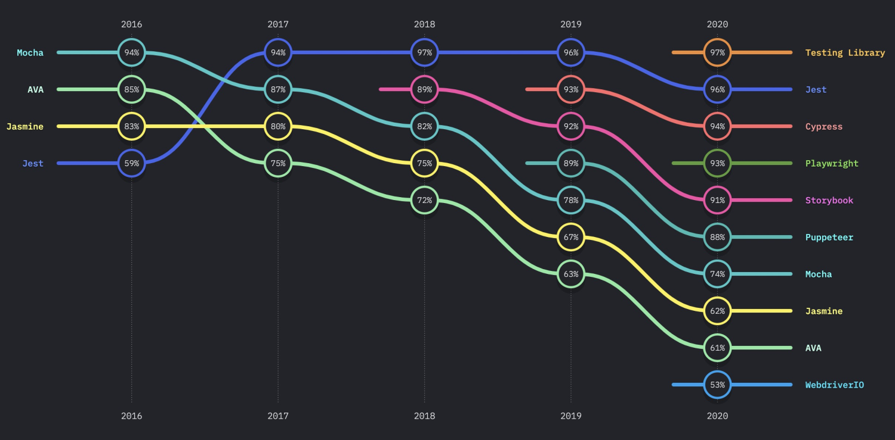
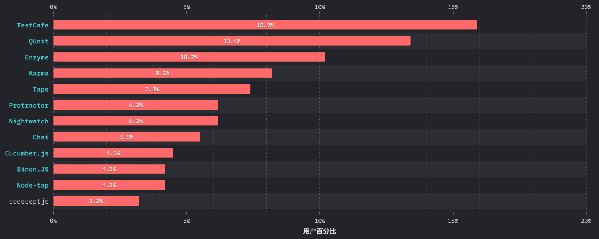
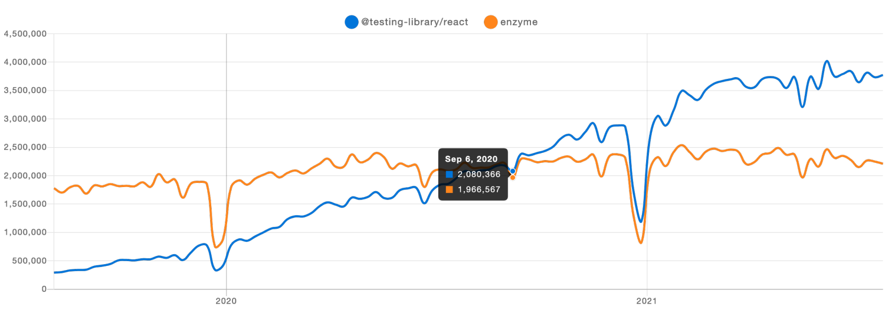

## 前言

对于 React 编写的组件库，本质上就是测试 React 组件，你可以用像测试其他 JavaScript 代码类似的方式测试 React 组件。现在有许多种测试 React 组件的方法。大体上可以被分为两类：

- **渲染组件树：**在一个简化的测试环境中渲染组件树并对它们的输出做断言检查。
- **运行完整应用：**在一个真实的浏览器环境中运行整个应用。

我们对于第一类称之为单元测试，本文主要专注于这种情况的测试策略；第二类称为端到端（end-to-end）测试，完整的端到端测试在防止对重要工作流的多次回归方面很有价值，对于组件的端到端测试会有专门一篇文章来介绍。

## 工具调研

对于测试工具的选择，主要从 2020 年的 [State of JavaScript Survey](https://2020.stateofjs.com/zh-Hans/technologies/testing/) 中列出的工具挑选。我们先从“使用度”和“满意度”两个角度来看测试生态圈的比较常用工具。




Jest、Storybook 在“使用度”和“满意度”上都获得了比较高的分数，新进入的 Testing Library 在“满意度”上也获得了高分。
​

> 注：
> 满意度：会再次使用 / (会再次使用 + 不会再次使用)
> 使用度：(将再次使用 + 将不再使用) / 总计

除了以上的几款工具，看看其他工具的用户百分比：


## 工具选择


先看看 React 官方网站（目前最新版本 v17.0.2）推荐的工具：

- Jest 是一个 JavaScript 测试运行器。它允许你使用 jsdom 操作 DOM 。尽管 jsdom 只是对浏览器工作表现的一个近似模拟，对测试 React 组件来说它通常也已经够用了。Jest 有着十分优秀的迭代速度，同时还提供了若干强大的功能，比如它可以模拟 modules 和 timers 让你更精细的控制代码如何执行。
- React Testing Library（简称：RTL）是一组能让你不依赖 React 组件具体实现对他们进行测试的辅助工具。它让重构工作变得轻而易举，还会推动你拥抱有关无障碍的最佳实践。虽然它不能让你省略子元素来浅（shallowly）渲染一个组件，但像 Jest 这样的测试运行器可以通过 mocking 让你做到。

实际上在 v16.7.0 版本的网站上，他们还推荐了另一个工具：

- Enzyme 是 React 的 JavaScript 测试实用程序，可以更轻松地测试 React 组件的输出。 你还可以操作、遍历和以某种方式模拟给定输出的运行时。Enzyme API 旨在通过模仿 jQuery API 来进行 DOM 操作和遍历，从而变得直观和灵活。

先说说 Jest，Jest = jsdom + Mocha + Sinon + Chai，从这里可以看出 Jest 的强大，而且它还是开箱即用的。
从 2018 年甚至更早，我们一直使用 Jest + Enzyme 来编写的单元测试，但是到 2020 年了，我们需要重新审视一下，选择一个目前来说合适的工具。后文主要拿 RTL 做对比后，先从历史说起。

### 一点历史

- 2016 年 3 月 2 日，Airbnb 官宣了 Enzyme——一个用来测试 React 组件的 JavaScript 库。在之前的三个月中，Enzyme 在 GitHub 上收获的 3000 个 Stars，50 个贡献者，其中有 45 个不是 Airbnb 的员工。
- 2018 年 3 月 15 日，Kent C.Dodds 在社交网站上发布他想做一个更轻量的测试库来替代 Enzyme。同年 4 月 2 日，Kent C.Dodds 在自己的博客上官宣了 React Testing Library——一个更轻量的 React 测试库，集成了 react-dom 和 react-dom/test-utils 的工具函数，提倡更好的测试实践。
- 2019 年 2 月，React 团队发布了期待已久的新版本 React（v16.8），该版本大幅改变了 API 并引入了 React Hooks。但是 Enzyme 并不支持单独测试 Hooks，而 RTL 可以通过单独库来支持。
- 2020 年 2 月 28 日，Airbnb 宣布他们将 Enzyme 的所有权转移到了一个外部 GitHub 组织。虽然他们承诺继续支持 Enzyme，但他们也提到 RTL 在他们的项目中越来越受欢迎。
- 2021 年，目前只有一名开发人员在维护 Enzyme——Jordan Harband。他是一位多产的开源贡献者，是 TC39 委员会的成员（他们定义 JavaScript），并且是一位真正的英雄，他独自维护着这款为全球数百万个测试套件提供支持的工具。

### npm trends



上图是 Enzyme 和 RTL 在两年内下载量的趋势，大约在 2020 年 9 月，RTL 的下载量实现反超，并在以后的一年里一骑绝尘。
现在看来，整个业界似乎已经转向 RTL 了。

### Talk is cheap, Show me code

假设我们现在有 Toggle 这样的一个组件：

```javascript
class Toggle extends React.Component {
  constructor(props) {
    super(props);
    this.state = { isToggleOn: true };

    this.handleClick = this.handleClick.bind(this);
  }

  handleClick() {
    this.setState((state) => ({
      isToggleOn: !state.isToggleOn,
    }));
  }

  render() {
    return <button onClick={this.handleClick}>{this.state.isToggleOn ? "ON" : "OFF"}</button>;
  }
}
```

Toggle 组件的测试用例至少包含以下两个：

1. 当 Toggle 处于 ON  状态时，点击后变成 OFF 状态；
1. 当 Toggle 处于 OFF 状态时，点击后变成 ON 状态；

使用 Enzyme 来实现，如下：

```javascript
describe("Toggle", () => {
  let component;
  beforeEach(() => {
    component = mount(<Toggle />);
  });

  it("can turn off when is on", () => {
    component.instance().handleClick();
    expect(component.state().isToggleOn).toEqual(false);
  });

  it("can turn on when is off", () => {
    component.setState({ isToggleOn: false });
    component.instance().handleClick();
    expect(component.state().isToggleOn).toEqual(true);
  });
});
```

使用 Testing Library 来实现，如下：

```javascript
describe("Toggle", () => {
  it("can turn off/on", async () => {
    const { container } = render(<Toggle />);
    fireEvent.click(container);
    expect(container.innerHTML).toEqual("OFF");

    fireEvent.click(container);
    expect(container.innerHTML).toEqual("ON");
  });
});
```

### 小结

借助 RTL，你可以轻松地编写测试，这些测试充分代表了用户如何体验应用程序。比方说，当你用 RTL 编写测试时，你在测试你的应用程序，就像你是与应用程序界面交互的用户一样。
另一方面，当你用 Enzyme 写测试时，即使你也能达到与 RTL 相同的自信水平，以类似于真实用户的方式构建测试结构有点麻烦。

## 总结

最看重的一点是 RTL 专注于测试用户体验——毕竟，这才是真正重要的。我们的客户不会看到我们的组件有什么 props，或者它们是数组还是对象，客户只关心它是否正常工作——并且会帮助你在未来交付价值。
React 的未来在于基于函数的组件、React Hooks、异步渲染，而这些特性今天最好搭配 RTL 使用。纵观 Enzyme 过去三年的发展历程，它似乎不太可能赶上所有这些特性，同时还能解决其他那么多问题。
更值得一提的是，使用 RTL 有助于提高组件库的无障碍性（Accessibility，简称 a11y）。对于组件库无障碍性，后面会用一篇文章来详细介绍。

## 参考

- GrowingIO Design：[https://github.com/growingio/gio-design](https://github.com/growingio/gio-design)
- State of JavaScript Survey：[https://2020.stateofjs.com/zh-Hans/technologies/testing/](https://2020.stateofjs.com/zh-Hans/technologies/testing/)
- Testing Overview：[https://reactjs.org/docs/testing.html](https://reactjs.org/docs/testing.html)
- Test Utilities：[https://5c54aa429e16c80007af3cd2--reactjs.netlify.app/docs/test-utils.html#overview](https://5c54aa429e16c80007af3cd2--reactjs.netlify.app/docs/test-utils.html#overview)
- Enzyme：[https://enzymejs.github.io/enzyme/](https://enzymejs.github.io/enzyme/)
- Enzyme: JavaScript Testing Utilties for React：[https://medium.com/airbnb-engineering/enzyme-javascript-testing-utilities-for-react-a417e5e5090f](https://medium.com/airbnb-engineering/enzyme-javascript-testing-utilities-for-react-a417e5e5090f)
- Enzyme‘s next Phase：[https://medium.com/airbnb-engineering/phase-ii-enzyme-d9efa717e297](https://medium.com/airbnb-engineering/phase-ii-enzyme-d9efa717e297)
- Jordan HarBand：[https://github.com/ljharb](https://github.com/ljharb)
- Snapshot Testing：[https://jestjs.io/docs/snapshot-testing](https://jestjs.io/docs/snapshot-testing)
- Storybook Unit Testing：[https://storybook.js.org/docs/react/workflows/unit-testing](https://storybook.js.org/docs/react/workflows/unit-testing)
- 无障碍：[https://developer.mozilla.org/zh-CN/docs/Web/Accessibility](https://developer.mozilla.org/zh-CN/docs/Web/Accessibility)
