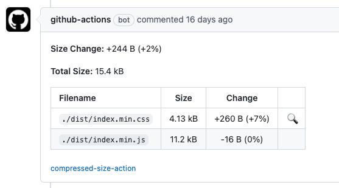

持续集成（Continuous integration）是一种 [DevOps](https://aws.amazon.com/cn/devops/) 软件开发实践。采用持续集成时，开发人员会定期将代码变更合并到一个中央存储库中，之后系统会自动运行构建和测试操作。持续集成的主要目标是更快发现并解决缺陷，提高软件质量，并减少验证和发布新软件更新所需的时间。


对于 Design System 组件库而言，它的持续集成主要包含以下任务：

- 代码构建
- 代码质量
- 单元测试
- 性能测试
- 代码安全

## 准备工作

做为前端项目，这里的核心操作就是安装依赖，并缓存 node_modules 目录。这样后续任务都可以使用此缓存，来加快安装速度。
核心逻辑如下：

```yaml
- name: Cache Node.js modules
  id: cache-node-modules
  uses: actions/cache@v2.1.7
  with:
    path: node_modules
    key: ${{ runner.os }}-${{ hashFiles('yarn.lock') }}
- name: Install dependencies
  if: steps.cache-node-modules.outputs.cache-hit != 'true'
  run: yarn install --frozen-lockfile
```

其中，node_modules 缓存的 key 用的是 `yarn.lock`文件的哈希值，这样文件已改变，key 就变了，缓存不会命中，在下一步就会执行`yarn install`来安装缺少的依赖。
详细配置见：

## 代码构建


这里主要执行两个任务：

1. 用 tsc 来做类型检查，通过`--noEmit`来实现不输出类型声明文件；
1. 用 Babel 来做编译，提早发现语法错误。

关于 tsc 和 Babel 的详细使用，参考之前文章：[打包工具](../bundle-tools)

详细配置见：[.github/workflows/ci.yml#L51](https://github.com/jack0pan/md-components-react/blob/bda086f50b39df4877f8eab55a9d2da43cc843db/.github/workflows/ci.yml#L51)

## 代码质量


代码质量依靠各种代码格式和检查工具，用到主要有：

- Prettier `npx prettier --check .`
- Stylelint `npx stylelint 'src/**/*.css'`
- ESLint `npx eslint . --ext js,ts,tsx`

关于这三个工具的使用，见一下文章：[开发工具](../develop-tools)

详细配置见：[.github/workflows/ci.yml#L29](https://github.com/jack0pan/md-components-react/blob/bda086f50b39df4877f8eab55a9d2da43cc843db/.github/workflows/ci.yml#L29)

## 单元测试


单元测试使用 Jest 工具来生成测试覆盖报告，命令如下：

```bash
npx jest --ci --coverage
```

关于 Jest 和组件单元测试见：[单元测试](../unit-testing)

详细配置如下：[.github/workflows/ci.yml#L107](https://github.com/jack0pan/md-components-react/blob/bda086f50b39df4877f8eab55a9d2da43cc843db/.github/workflows/ci.yml#L107)

## 性能测试


性能测试目前是使用 [preactjs/compressed-size-action](https://github.com/preactjs/compressed-size-action) 来检查每个 PR 对打包后体积的影响。它在 PR 上 comment 结果，如下：



详细配置如下：[.github/workflows/ci.yml#L89](https://github.com/jack0pan/md-components-react/blob/bda086f50b39df4877f8eab55a9d2da43cc843db/.github/workflows/ci.yml#L89)

## 代码安全


这里使用 GitHub 推出的 CodeQL 来对代码仓库进行安全检查。CodeQL 生成的检查结果如下：


详细配置如下：[.github/workflows/ci.yml#L71](https://github.com/jack0pan/md-components-react/blob/bda086f50b39df4877f8eab55a9d2da43cc843db/.github/workflows/ci.yml#L71)

## 总结

上面只是分步介绍了每个任务完成的事情，完整的持续集成工作流见此文件：
[.github/workflows/ci.yml](https://github.com/jack0pan/md-components-react/blob/bda086f50b39df4877f8eab55a9d2da43cc843db/.github/workflows/ci.yml)
