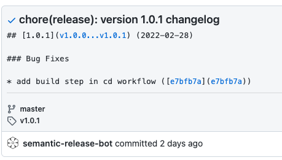
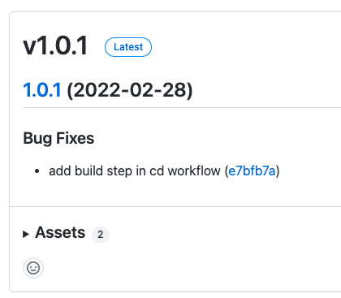
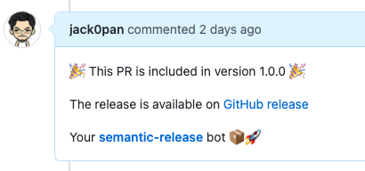
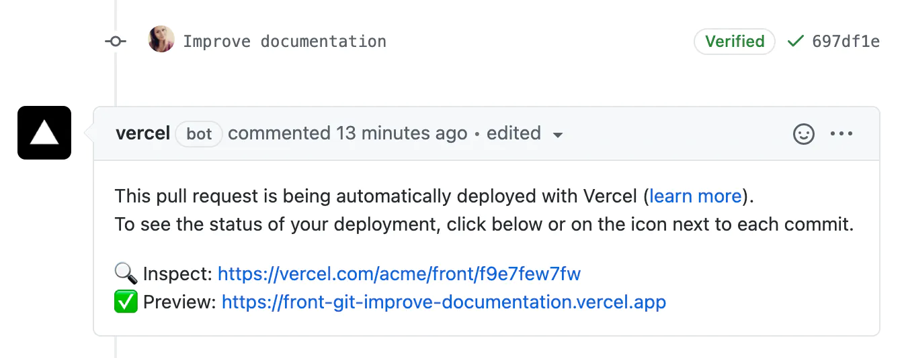
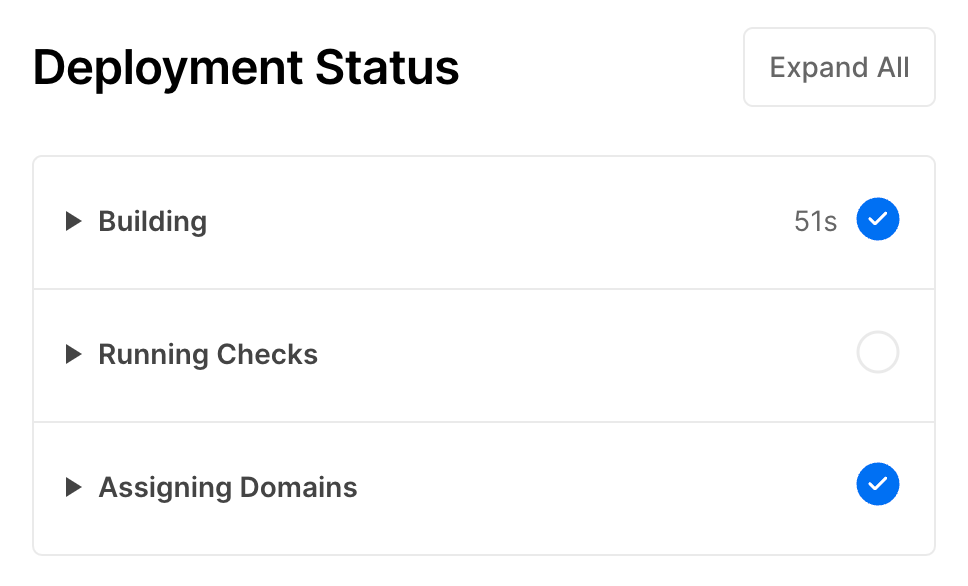
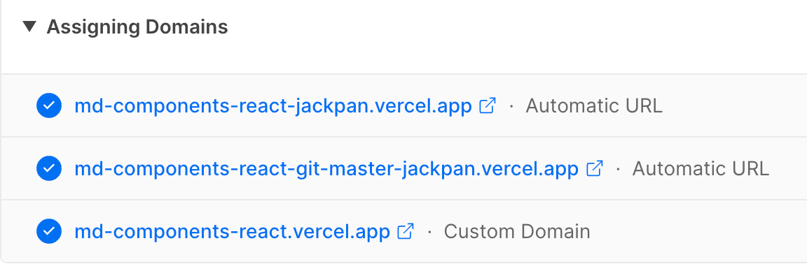

持续交付（Continuous delivery）指的是，频繁地将软件的新版本，交付给质量团队或者用户，以供评审。如果评审通过，代码就进入生产阶段。持续交付可以看作持续集成的下一步。它强调的是，不管怎么更新，软件是随时随地可以交付的。
持续部署（Continuous deployment）是持续交付的下一步，指的是代码通过评审以后，自动部署到生产环境。

## 持续交付


对于 Design System 组件库，持续交付主要是把打包后的产物发布到 npm 上。

1. Build package 是构建出各种产物，执行命令就是：

```bash
npx gulp
```

关于这部分的详细介绍见：[打包工具](../bundle-tools)

2. Semantic release 是把产物发布到 npm 上，生成 changelog，并提交到 GitHub 上，而且还会对已发布的 PR 提交 comment，以下是一些示例：

```plain
[7:13:01 AM] [semantic-release] › ✔  Completed step "analyzeCommits" of plugin "@semantic-release/commit-analyzer"
[7:13:02 AM] [semantic-release] › ℹ  The next release version is 1.0.1
```

```plain
[7:13:02 AM] [semantic-release] › ℹ  Start step "generateNotes" of plugin "@semantic-release/release-notes-generator"
[7:13:02 AM] [semantic-release] › ✔  Completed step "generateNotes" of plugin "@semantic-release/release-notes-generator"
[7:13:02 AM] [semantic-release] › ℹ  Start step "prepare" of plugin "@semantic-release/changelog"
[7:13:02 AM] [semantic-release] [@semantic-release/changelog] › ℹ  Update /home/runner/work/md-components-react/md-components-react/CHANGELOG.md
[7:13:02 AM] [semantic-release] › ✔  Completed step "prepare" of plugin "@semantic-release/changelog"
```

<center>



提交 changelog 的 commit



GitHub 上创建的 release



GitHub 上对已发布 PR 的 comment

</center>

semantic-release 详细使用见：[semantic-release 使用教程](../66771464?view=doc_embed)

详细配置如下：[.github/workflows/cd.yml](https://github.com/jack0pan/md-components-react/blob/bda086f50b39df4877f8eab55a9d2da43cc843db/.github/workflows/cd.yml)

## 持续部署



对于 Design System 组件库，持续部署做的事情是部署 Demo 网站。这里使用 Vercel 来托管。为什么使用它见对比文章。
Vercel 使用也特别方便，初始化好项目后，Vercel 会监听 GitHub 上的 Push 和 PR 事件，来自动触发部署。



Vercel 在每次部署做的事情就是三步：

1. 执行配置好的 build 命令；

```plain
Cloning completed: 408.714ms
Analyzing source code...
Installing build runtime...
Build runtime installed: 3.279s
Looking up build cache...
Build cache downloaded [117.32 MB]: 5456.591ms
Running "install" command: `yarn install`...
...
info => Output directory: /vercel/path0/storybook-static
Done in 34.66s.
Uploading build outputs...
Deploying build outputs...
Build completed. Populating build cache...
Uploading build cache [117.32 MB]...
Build cache uploaded: 3.565s
Done with "package.json"
```

2. 运行自定义的检查，如果没配置会跳过；
3. 绑定域名，包括自定义的和 Vercel 自动分配的。



## 参考

- [https://www.ruanyifeng.com/blog/2015/09/continuous-integration.html](https://www.ruanyifeng.com/blog/2015/09/continuous-integration.html)

​
