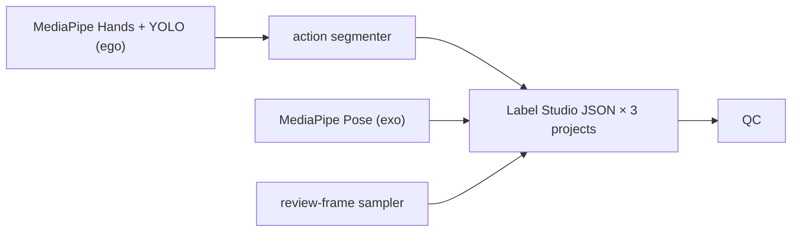

import Callout from '../../../components/Callout.astro';

I recently shipped a Phase-1 pre-annotation pipeline for an embodied-robot Pick-and-Place dataset — multiple tasks, dual ego/exo camera footage, hundreds of clips. The job: turn raw MP4s into Label Studio task JSON that a human can land on and just *verify*, instead of starting from scratch.

This post is a tour of the architectural decisions I'd want to know before building the next one.

## The pipeline, in one line



CLI-wise that's four atomic subcommands plus an orchestrator:

| Subcommand  | Job                                                |
|-------------|----------------------------------------------------|
| `handmark`  | ego inference: hands, arms, operated objects       |
| `posemark`  | exo inference: body skeleton                       |
| `segment`   | per-episode action segmentation                    |
| `export-ls` | sample review frames, build LS task JSON, run QC   |
| `process`   | run all four end-to-end                            |

Each step is independently re-runnable, and `process` is just a thin orchestrator. That's mostly so I can rerun a single failing step without rebuilding the world — but it also turned out to be the trick that kept the tests fast (more below).

## Three Label Studio projects, not one

This is the decision I'd flag first if a colleague were building something similar.

A single episode fans out into **three separate Label Studio projects**, each with its own XML config and its own task JSON:

| Project | What gets labeled                                  | Input                            |
|---------|----------------------------------------------------|----------------------------------|
| A       | Action timeline (`TimelineLabels` on the ego video) | 1 task = the video itself       |
| B       | Hand keypoints + operated-object bbox              | N sampled ego frames             |
| C       | Body skeleton                                      | N sampled exo frames             |

Why not one project with everything? Label Studio can't put a `<Video>` element and image-based `<KeyPoint>` annotations on the same task — and the ego/exo frames come from different streams anyway. I tried to be clever about this at first; don't. Three projects, three task JSONs, three labelers' worth of UI clutter avoided.

An `aggregate` step merges per-episode JSONs into per-project task files, which is what the humans actually import.

## Two independent frame rates

The spec said 30 fps. The actual footage was 59.94 fps (NTSC), and **never** hard-coding 30 turned out to be the easy decision. The harder one was untangling two different fps knobs that always get conflated:

1. **Inference fps** — how often MediaPipe and YOLO run. Defaults to native fps. `--inference-fps N` strides the video so MediaPipe / YOLO's `vid_stride` skip frames. JSON keys stay real frame indices, so `duration_frames` math doesn't drift.
2. **Review-frame sampling** — how many JPEGs the human ever sees in Project B / C. Independent from inference.

Conflating these is how you end up either burning GPU on frames nobody will ever look at, or starving the segmenter of motion signal because you downsampled everything.

<Callout type="warn">
  Cutting inference fps to 1 saves a lot of compute, but the action segmenter relies on per-frame hand motion. Empirically F1 drops from ~72% to noise. Reserve `--inference-fps` for "I just want to spot-check a clip", not the actual production run.
</Callout>

## One module owns every path on disk

There are six places in the codebase that need to know where a thing lives on disk: each of the four atomic steps, `aggregate`, and the QC runner. The fastest way to make any of them disagree silently is to let each one assemble its own path strings.

So all paths — source videos, predictions JSON, review-frames directory, LS task JSON, QC JSON, and even the `/data/local-files/?d=<rel>` URL Label Studio sees — go through one of two dataclasses in a single `layout` module:

- `TaskLayout` — knows about a task directory
- `EpisodeLayout` — knows about a single episode within a task

`aggregate` reconstructs the same `EpisodeLayout` from a different starting point than `process` did, and the only reason that works is they ask the same dataclass. The first mid-project refactor was collapsing four ad-hoc path helpers down to these two.

## Canonical filenames buy zero-config batching

A naming convention like `NN_NNN_{ego,exo}.mp4` — e.g. `01_001_ego.mp4` — encodes enough metadata that batch mode needs no config:

- `task_subdir` is inferred from the path `videos/ego/<task_subdir>/...`
- `task_id` is parsed from the `NN` prefix and used to look up the action-label template
- ego ↔ exo pairing is just a string replace

So the steady-state command is a single line pointed at a task directory. Already-processed episodes are skipped (`--force` to re-run). Per-episode failures are isolated, so one corrupt MP4 doesn't kill the batch. Both are cheap to add once you've got the layout abstraction.

## Don't use Label Studio Source Storage

LS has a "Cloud Storage → Add Source Storage" feature that looks like exactly what you want when your data is local. It is not.

LS auto-creates a task for every file under the storage root. Combined with the imported tasks (the JSON you actually want), that fans out into tens of thousands of phantom tasks that conflict with the real ones.

Use `LOCAL_FILES_SERVING_ENABLED=true` plus `LOCAL_FILES_DOCUMENT_ROOT=$(pwd)/data` instead, and reference files in task JSON as `/data/local-files/?d=<rel>`. No Source Storage. No phantoms.

## Sampling: four signals, not one fps knob

Default review-frame sampling for Project B (hand + object on ego) uses four signals:

- segment boundaries (high information per frame)
- 2 uniform frames per segment (middle-of-action coverage)
- low-confidence frames (model uncertainty = likely error)
- bbox-area jumps > 50% (suspicious object detection)

For a ~2-minute clip that lands at 30–50 frames per Project-B task. Project C (body pose on exo) is plain uniform 12 frames. Both are overridable by `--review-hand-fps` / `--review-pose-fps` / `--review-fps` (per-project flag wins).

The point isn't that the strategy is optimal — it's that it gives humans frames that are *worth looking at* instead of 60 near-identical mid-action frames where the model was already confident.

## Tests stay pure-Python

`mediapipe`, `ultralytics`, and `cv2` are slow to import and need model weights at runtime. The tests need none of that — they exercise the schema, the segmenter, QC, layout, and the LS-JSON transform.

The trick: every inference-heavy import is **lazy inside function bodies**, never at module top level.

```python
def run_handmark_episode(...):
    import mediapipe as mp  # lazy
    import cv2
    ...
```

That keeps the test suite runnable with no model downloads, finishing in under a second. Boring, but it's what makes CI cheap and what lets me run the whole thing during a flight.

## What I'd build next

Phase 2 is where the human verifications loop back into the model: harvest exports, regenerate a training set, fine-tune. The Phase-1 pipeline is intentionally one-shot — its job is to give Phase 2 a clean substrate to read from. The three project JSONs, the QC JSON, and the `aggregate` step were all shaped by that handoff.

If you're building something similar: pick the path abstraction first, then the rest.
