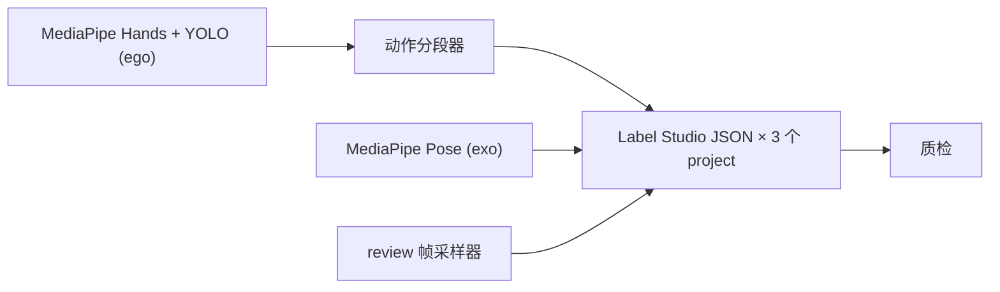

import Callout from '../../../components/Callout.astro';

最近做完一条 Phase-1 的视频预标注流水线，对象是一个具身机器人 Pick-and-Place 数据集——多个任务、ego/exo 双视角、几百段素材。要做的事情很直接：把原始 MP4 转成 Label Studio 的任务 JSON，让标注员上来直接「校验」，而不是从零标。

这篇文章梳理一下，如果再做一遍我会希望提前知道的那些架构决定。

## 一句话讲完整条管线



CLI 拆成四个原子子命令 + 一个编排器：

| 子命令       | 做什么                                          |
|--------------|------------------------------------------------|
| `handmark`   | ego 推理：手 + 手臂 + 操作物体                  |
| `posemark`   | exo 推理：人体骨骼                              |
| `segment`    | 单 episode 动作分段                             |
| `export-ls`  | 抽 review 帧 + 拼 LS 任务 JSON + 质检           |
| `process`    | 端到端把上面四步串起来                          |

每一步都能独立重跑，`process` 就是个薄壳。最初这么拆是为了某一步挂了能单独重跑而不用从头来一遍——后来发现它顺带让测试跑得很快（后面会说）。

## 三个 Label Studio project，不是一个

如果同事来问，这是我会第一个拎出来讲的决定。

一个 episode 会**展开成三个独立的 Label Studio project**，每个有自己的 XML 配置和任务 JSON：

| Project | 标注内容                                          | 输入                       |
|---------|--------------------------------------------------|---------------------------|
| A       | 动作时间线（ego 视频上的 `TimelineLabels`）       | 1 个 task = 视频本身       |
| B       | 手部关键点 + 操作物体 bbox                        | N 张采样的 ego 帧          |
| C       | 人体骨骼                                          | N 张采样的 exo 帧          |

为什么不在一个 project 里全做完？Label Studio 没法在同一个 task 里既放 `<Video>` 又放基于图片的 `<KeyPoint>`——而且 ego / exo 本来就是两路流。我一开始还想搞个聪明办法把它们合一起，别这么干。三个 project、三份任务 JSON，省下三份标注员的 UI 干扰。

一个 `aggregate` 步骤负责把 per-episode 的 JSON 合并成按 project 划分的任务文件——标注员实际导入的就是这几个文件。

深挖：[为什么一个 episode 要拆成三个 Label Studio project →](/posts/three-label-studio-projects/)

## 两套互相独立的帧率

管线里有两个 fps 旋钮，初看像一回事，其实互相独立：

1. **推理帧率**——MediaPipe / YOLO 多久跑一次。默认就是视频原生 fps。`--inference-fps N` 会按 stride 跳帧（MediaPipe 自己步进，YOLO 用 `vid_stride`）。JSON key 仍然是真实帧号，`duration_frames` 的算术不会错位。
2. **review 帧采样**——Project B / C 里标注员最终会看到多少张 JPEG。这个跟推理完全独立。

把这两个混在一起，要么是 GPU 跑了一堆没人会看的帧，要么是过度降采样让分段器拿不到足够的运动信号。

<Callout type="warn">
  把推理 fps 砍到 1 能省一大笔算力，但动作分段器依赖逐帧的手部运动。实测 F1 会从 ~72% 掉到噪声。`--inference-fps` 只留给「快速抽查一段」用，正经跑别动它。
</Callout>

深挖：[视频预标注管线里的两套帧率 →](/posts/two-fps-knobs/)

## 一个模块管所有磁盘上的路径

代码里有六个地方需要知道某个东西在磁盘上的位置：四个原子步骤、`aggregate`、质检脚本。让这六个地方静默地不一致，最快的办法就是放任每一处都自己拼路径字符串。

所以所有路径——源视频、预测 JSON、review 帧目录、LS 任务 JSON、质检 JSON，甚至 Label Studio 看到的那个 `/data/local-files/?d=<rel>` URL——都得过同一个 `layout` 模块里这两个 dataclass 之一：

- `TaskLayout` —— 知道一个 task 目录的结构
- `EpisodeLayout` —— 知道单个 episode 的结构

`aggregate` 是从跟 `process` 完全不同的起点重建出同一个 `EpisodeLayout` 的，它能对得上完全是因为两边问的是同一个 dataclass。中途做的第一次重构就是把四个临时凑出来的路径辅助函数收敛到这俩上面。

深挖：[一个模块管所有磁盘上的路径 →](/posts/one-module-owns-every-path/)

## 规范文件名换零配置批跑

命名约定 `NN_NNN_{ego,exo}.mp4`——比如 `01_001_ego.mp4`——把元信息塞够了，批跑模式不需要任何额外配置：

- `task_subdir` 从路径 `videos/ego/<task_subdir>/...` 推断
- `task_id` 从开头的 `NN` 解析，用来查动作模板
- ego ↔ exo 配对就是一次字符串替换

所以稳态下只需要一行命令指向一个 task 目录就够了。已经处理过的 episode 默认跳过（`--force` 强制重跑）。每个 episode 的失败是隔离的，一段坏的 MP4 不会把整个批次拉死。这两件事只要 layout 抽象到位了，加起来都不贵。

深挖：[规范文件名换零配置批跑 →](/posts/canonical-filenames-zero-config-batching/)

## 别用 Label Studio 的 Source Storage

LS 有一个「Cloud Storage → Add Source Storage」功能，名字看起来就是为本地数据准备的。它不是。

LS 会给 storage 根目录下的**每一个文件**自动建 task。加上你 Import 进去的真任务，会展开出几万个跟真任务冲突的幽灵 task。

正确做法：开 `LOCAL_FILES_SERVING_ENABLED=true`，把 `LOCAL_FILES_DOCUMENT_ROOT` 指到 `$(pwd)/data`，任务 JSON 里的 URL 统一写成 `/data/local-files/?d=<rel>`。不碰 Source Storage，就没有幽灵 task。

深挖：[别用 Label Studio 的 Source Storage 接本地文件 →](/posts/dont-use-label-studio-source-storage/)

## 采样：四个信号，不是一个 fps 旋钮

Project B（ego 上的手 + 物品）的默认 review 帧采样用四个信号：

- 段边界（每帧信息量最高的地方）
- 段内均匀抽 2 帧（覆盖动作中间状态）
- 低置信度帧（模型不确定 = 可能错）
- bbox 面积跳变 > 50%（疑似检测异常）

一段 ~2 分钟的视频，每个 Project B task 落在 30–50 帧。Project C（exo 上的人体骨骼）用纯均匀采样 12 帧。两边都能被 `--review-hand-fps` / `--review-pose-fps` / `--review-fps` 覆盖（per-project 的优先级更高）。

这套策略的意义不是「最优」——是给标注员**值得看的**那些帧，而不是 60 张几乎一模一样的、模型本来就很确定的动作中间帧。

深挖：[review 帧采样的四个信号 →](/posts/four-signal-frame-sampling/)

## 测试坚持纯 Python

`mediapipe`、`ultralytics`、`cv2` 导入慢，运行时还要拉模型权重。测试一个都用不上——它测的是 schema、分段器、质检、layout、LS JSON 转换。

技巧很简单：每一个推理相关的 import 都**懒加载在函数体里**，绝不放在模块顶层。

```python
def run_handmark_episode(...):
    import mediapipe as mp  # 懒导入
    import cv2
    ...
```

这样全套测试不用下模型就能跑，一秒之内跑完。听起来很无聊，但 CI 的成本就是这么压下来的，飞机上也能跑全套。

深挖：[用懒导入把 mediapipe / cv2 关在测试之外 →](/posts/lazy-imports-pure-python-tests/)

## 下一步会怎么做

Phase 2 是把人工校验回灌进模型的部分：从导出重新生成训练集、做微调。Phase-1 流水线被故意做成一次性的——它的职责就是给 Phase 2 一份干净的、好读的素材。三份 project JSON、质检 JSON、`aggregate` 这一步，都是围绕这个交接面长出来的。

Phase-2 设计笔记（还没 ship）：
- [什么算 ground truth →](/posts/phase-2-ground-truth/)
- [别每次导出都重训 →](/posts/phase-2-retraining-cadence/)
- [eval 集**绝不**能见过预标注 →](/posts/phase-2-clean-eval-set/)
- [版本号挂在 slice 上，不挂在 snapshot 上 →](/posts/phase-2-version-the-slice/)

如果你在做类似的东西：路径抽象先选好，剩下的都好办。
